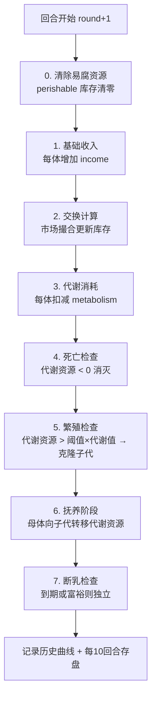
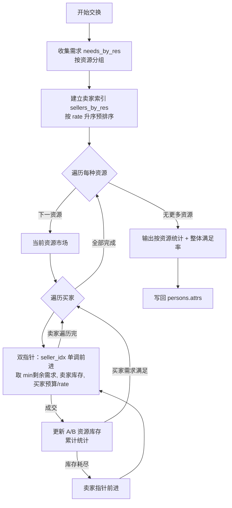

# 经济系统模拟（Money System）

一个基于多智能体的市场经济演化仿真平台。每个"个体"是拥有资源、代谢、收入、需求与交易规则的经济主体，系统按回合推进，模拟代谢消耗、收入、死亡、繁殖、抚养以及基于挂牌定价的市场交换过程。

- **后端**：纯 Python 标准库 `http.server`，无第三方依赖，单线程保证状态一致性
- **前端**：原生 HTML/CSS/JavaScript（`index.html` 运行页 + `economy.html` 管理页，共享 `common.js`/`common.css`），通过 `fetch` 调用后端 API，使用 ECharts 绘制饼图与历史曲线
- **性能目标**：支持 30 万+ 个体，单回合 < 2 秒，内存 < 2 GB

---

## 目录

- [功能特性](#功能特性)
- [技术栈](#技术栈)
- [项目结构](#项目结构)
- [快速开始](#快速开始)
- [核心概念](#核心概念)
- [仿真流程](#仿真流程)
- [价格自适应（轻量价格发现）](#价格自适应轻量价格发现)
- [自动运行](#自动运行)
- [历史曲线与时间窗口](#历史曲线与时间窗口)
- [历史持久化（分层降采样 + 追加写）](#历史持久化分层降采样--追加写)
- [交换算法](#交换算法)
- [HTTP API](#http-api)
- [配置文件](#配置文件)
- [工程约束与设计要点](#工程约束与设计要点)

---

## 功能特性

- **回合制仿真**：每回合依次执行清除易腐→收入→交换→代谢→死亡→繁殖→抚养，闭环推进
- **个体建模**：每个体拥有资源库存、代谢/收入参数、需求列表与挂牌交易规则
- **挂牌交易**：卖方明码标价（1 单位 sell = rate 单位 buy），买方按价格升序优先购买
- **价格自适应（轻量价格发现）**：可开关。按每个挂牌的成交率反馈调价——卖光涨价、滞销降价，让价格传递稀缺信号、资源配置被修正
- **自动运行**：一键启动/暂停/继续的回合循环，速度可调（回合/分钟）
- **历史曲线与时间窗口**：默认显示近 100 回合，支持 50/100/500/1000 窗口预设与滑块滑回查看任意历史区间，可「跟随最新」自动滚动
- **可视化面板**：基础设置、个体管理（搜索/分页）、个体详情、运行日志、人口饼图、历史曲线
- **配置持久化**：基础设置与个体列表以 JSON 文件存于 `config/`，支持导入/导出
- **历史曲线**：每回合记录人口、分组、资源总量；采用分层降采样存储，跑 100 万回合内存与磁盘也恒定（见[历史持久化](#历史持久化分层降采样--追加写)）

---

## 技术栈

| 层级 | 技术 |
|------|------|
| 后端引擎 | Python 3（标准库，无第三方依赖） |
| HTTP 服务 | `http.server.HTTPServer`（单线程） |
| 前端 | 原生 HTML/CSS/JavaScript + `fetch` |
| 图表 | ECharts（饼图、历史曲线） |
| 数据 | JSON 配置文件 + JSON 历史快照 |

---

## 项目结构

```
money_system/
├── app.py                      # HTTP 服务（路由 + 静态文件 + 序列化）
├── engine/                     # 仿真引擎包（对外 API 与原 engine.py 一致）
│   ├── __init__.py             # 门面：全量 re-export，保持 from engine import ... 不变
│   ├── model.py                # A 数据结构 + 规范化 + 格式化/统计工具（零依赖）
│   ├── history.py              # B 历史分层降采样持久化（HistoryStore）
│   ├── metrics.py              # C 回合经济指标计算（纯函数 compute_metrics）
│   ├── config_io.py            # F 个体/设置 JSON 序列化与导入导出
│   └── core.py                 # Simulation（D 交换撮合 + E 回合流程）
├── index.html                  # 前端：运行页（回合控制/日志/饼图/历史曲线）
├── economy.html                # 前端：管理页（基础设置/个体管理/导入导出）
├── common.js                   # 前后端共享的前端逻辑
├── common.css                  # 共享样式
├── config/
│   ├── economy_defaults.json   # 基础设置（新建个体的模板）
│   └── economy_persons.json    # 初始个体列表
├── snapshots/                  # 运行时历史快照（history.json，每 10 回合存盘）
├── bench_a1.py / bench_a2.py / bench_a3.py   # 性能基准测试脚本
├── test_persist.py             # 持久化冒烟测试
├── 启动经济系统.bat             # Windows 一键启动脚本
└── .gitignore
```

### 引擎拆分（engine/ 包）

引擎按职责边界拆为五层，对外 `from engine import ...` 与原 `engine.py` 完全兼容：

| 层 | 文件 | 职责 | 依赖 |
|---|---|---|---|
| A | `model.py` | 数据结构（`Person`/`Rule`/`Need`/`Government`/`DefaultSettings`）+ 规范化 + 格式化/统计工具 | 仅标准库 |
| B | `history.py` | 历史曲线分层降采样持久化（`HistoryStore`：加载/追加写/归档/压缩/切片） | 仅标准库 |
| C | `metrics.py` | 回合经济指标计算（纯函数 `compute_metrics`） | A |
| F | `config_io.py` | 个体/基础设置的 JSON 序列化与导入导出 | A |
| 核心 | `core.py` | `Simulation`（D 交换撮合 + E 回合流程），持久化委托 B、指标委托 C | A/B/C/F |

要点：

- `core.Simulation` 持有 `HistoryStore` 实例，通过 `history` / `get_history` / `clear_history` /
  `persist_errors` / `_maybe_persist` 等属性与方法委托，保留了测试/基准直连的接口（如
  `sim._persist_every`、`sim._levels`、`sim._compact_l0()`）。
- D（撮合）与 E（回合流程）仍合在 `core.py`：二者共享 `res_delta` 账本、成交聚合暂存与
  verbose 日志渲染，强行拆分收益低、风险高；且 `calculate()` 的热循环为性能敏感代码。
- `python -m engine` 等价于旧版 `python engine.py` 的冒烟测试。

---

## 快速开始

### 环境要求

- Python 3.10+（使用了 `list[dict]`、`int | None` 等类型注解语法）

### 方式一：一键启动（Windows）

双击运行 `启动经济系统.bat`，脚本会自动：
1. 检查 Python 是否在 PATH 中
2. 检测并释放 8000 端口
3. 启动后端服务（新窗口，标题 "MoneySystem API"）
4. 打开浏览器访问 `http://127.0.0.1:8000/`

### 方式二：手动启动

```bash
# 在项目根目录执行
python app.py
```

启动后浏览器访问：<http://127.0.0.1:8000/>

默认监听 `127.0.0.1:8000`，可通过环境变量 `PORT` 修改端口：

```bash
set PORT=9000 && python app.py
```

---

## 核心概念

### 个体（Person）

| 字段 | 说明 |
|------|------|
| `id` / `parentId` | 个体 ID 与母体 ID（繁殖时永久记录） |
| `name` | 名称；子代命名为 `基础名#子代ID`（避免链式 `#` 叠加） |
| `metabolism` | 代谢：每回合扣减 `amount` 单位 `res` 资源 |
| `income` | 收入：每回合增加 `amount` 单位 `res` 资源 |
| `attrs` | 资源库存字典，如 `{"食物": 50, "钱": 100}` |
| `needs` | 需求列表，`{key: 资源名, amount: 需求量}` |
| `rules` | 挂牌规则列表，`{sell, buy, rate}`：1 单位 sell 换 rate 单位 buy |
| `canReproduce` | 是否允许繁殖 |
| `reproThresholdMult` | 繁殖阈值倍数：代谢资源 > 阈值倍数 × 代谢值 时繁殖 |
| `reproInheritMult` | 子代继承倍数：子代初始代谢资源 = 继承倍数 × 代谢值 |

### 基础设置（DefaultSettings）

新建个体时的模板，结构与个体一致（不含 `id`/`parentId`/`name`）。修改后仅影响后续新建的个体。

| 字段 | 说明 |
|------|------|
| `metabolism` / `income` | 代谢与收入模板 |
| `reproThresholdMult` / `reproInheritMult` / `reproInheritRatio` | 繁殖阈值、继承倍数、非代谢资源继承比例 |
| `weanMinRounds` / `weanMaxRounds` | 最小/最大养育期 |
| `attrs` / `needs` / `rules` | 初始资源、需求、挂牌规则模板 |
| `perishable_resources` | 易腐资源列表（每回合开始清零，仅当期有效） |
| `adaptive_pricing` | 是否启用轻量价格发现（默认 `false`） |
| `price_adjust_alpha` | 调价强度 α，0~1（默认 `0.1`） |

---

## 仿真流程

### 回合闭环

每调用一次「下一回合」，引擎按以下顺序执行：



**关键规则**：
- **死亡清算**：代谢资源被扣到负数的个体立即消灭（破产）；其剩余资产转入政府国库，不再凭空消失
- **繁殖**：母体消耗 `阈值×代谢值` 的代谢资源，子代继承 `继承倍数×代谢值`，其余资源克隆自母体
- **抚养**：母体按子代代谢值逐个转移资源，资源不足时部分转移或失败
- **易腐资源**：如劳动力，每回合开始清零，仅当期有效，必须先交换获得才能代谢

---

## 价格自适应（轻量价格发现）

真实经济的灵魂是价格发现。默认 `rate` 是挂牌常量——短缺不涨价、过剩不降价，价格不传递稀缺信息。开启价格自适应后，价格会随成交情况变化：

**机制**：每回合交换出清后，对每个挂牌按其成交率反馈调整单价

```
fill = 成交量 / 挂牌库存          # ∈ [0, 1]
rate *= (1 + α · (2·fill − 1))
```

- `fill = 1`（卖光）→ `×(1+α)` 涨价
- `fill = 0`（滞销）→ `×(1−α)` 降价
- 价格下限 `1e-6` 防止归零

**开启方式**：管理页 → 基础设置 → 「价格自适应」区块，勾选启用并设置调价强度 α（0~1，越大波动越剧烈）。

**性质与局限**：这是轻量启发式——价格随供需起伏、短缺涨价/过剩降价，从而让资源配置被修正；但信号是局部、滞后的，可能过冲震荡而非收敛到真实均衡价。若需完备的价格发现（买卖双向挂单、按均衡价出清的订单簿撮合），属于更大的结构性重构。

---

## 自动运行

首页回合面板提供 `▶ 自动运行` 按钮：

- 点一下**开始**，再点**暂停**，再点**继续**（播放/暂停切换，按钮文案/颜色随之变化）
- **速度**：`回合/分钟` 输入，节拍间隔 = `60000 / 速率`
- 前端驱动，递归 `setTimeout` 串行执行：等上一拍 `nextRound` 真正返回后再排下一拍，**杜绝请求重叠**
- 自动模式任意一拍报错立即停止并弹错
- 实际速率受单回合处理耗时限制（若单回合要 200ms，则最快约 5 回合/秒）
- 不强制存档、速率不封顶

---

## 历史曲线与时间窗口

回合数增多时，不再把所有数据塞进一张图，而是可滑动的时间窗口：

- **窗口预设**：`50 / 100（默认）/ 500 / 1000` 回合
- **滑动查看**：拖动滑块，窗口在历史中左右移动，回看任意过去区间
- **跟随最新**：勾选时滑块贴最右端，自动运行时随回合自动滚动到最新；一旦拖动滑块即取消跟随、锁定到所选历史区间
- 只请求并显示窗口区间数据（点数 = 窗口大小），与总回合数无关，十万回合也不卡

后端 `/history?from=&to=` 已支持区间切片，前端按需取数。

### 经济指标（生态健康）

历史曲线面板下方附「经济指标」图（**双 Y 轴**：左轴 0~1 比率指标，右轴价格指数），用于观察系统性的生态与结构健康，弥补「只有人口和资源总量」的盲区。每回合在 `metrics` 字段中记录：

| 指标 | 含义 | 口径 |
|------|------|------|
| `price_index` | 价格指数（成交加权） | 以单一记账单位（默认 `钱`，可在基础设置 `price_index_numeraire` 配置）计的平均「每单位商品值多少 钱」；前端归一化首非空点 = 100 |
| `gini` | 基尼系数 | 个体财富净值（全部 `attrs` 之和）分布的集中度，0=平等、1=集中 |
| `hhi_wealth` | 产业集中度（财富 HHI） | 各基础名群体财富占比的平方和 Σshare²，1/n~1 |
| `hhi_pop` | 产业集中度（人口 HHI） | 各基础名群体人口占比的平方和 |
| `unemployment` | 失业率（劳动力口径） | 挂出 `劳动力` 却 0 成交者占「挂出劳动力者」比例；无劳动力市场时置 `null` |
| `met_rate` | 需求满足率 | 整体已满足需求 / 总需求的成交率（生态健康信号） |
| `volume` / `born` / `dead` | 成交总量 / 出生数 / 死亡数 | 回合事件计数 |

> 说明：价格指数为「成交加权」（依赖 `calculate()` 暴露的本回合成交聚合）；失业率定义来自「劳动力」易腐资源。无成交 / 无人挂劳动力时对应指标为 `null`，老历史数据缺字段也能正常显示。

---

## 历史持久化（分层降采样 + 追加写）

历史每回合增一行，若「每 10 回合全量重写整个数组」，累计写入量是 **O(R²)**：
实测跑到 10 万回合时单次重写约 5.5 秒，累计约 7.6 小时纯写盘；而服务是单线程的，
每次重写都会冻结所有请求，表现为后期「每 10 回合卡 0.5~5 秒」的间歇性卡顿。

改为分层存储：

| 层 | 分辨率 | 覆盖范围 | 文件 |
|------|--------|----------|------|
| L0 | 1 回合/点 | 最近 1000 回合 | `snapshots/history-l0.jsonl`（追加写，一行一回合） |
| L1 | 10 回合/点 | 再往前 1 万回合 | `snapshots/history-archive.json` |
| L2 | 100 回合/点 | 再往前 10 万回合 | 同上（逐层递进） |

- **内存与磁盘均为 O(log R)**：每层上限 1000 行，跑 100 万回合也只有约 3000 行
- **写入成本与已跑回合数无关**：L0 只追加新增行；归档层每累计 100 次折叠才落盘一次
- **实测**：5000 回合中持久化仅 **0.147 ms/回合**（旧方案同规模累计约 11.6 s，且随回合数平方增长）

### 聚合规则（按字段语义分派）

折叠时**不能**一律取平均——否则计数类指标会随折叠倍率缩水，而且是静默错误（不报错、只失真）：

| 字段 | 语义 | 聚合方式 |
|------|------|----------|
| `volume` / `born` / `dead` | 计数 | **求和** |
| `price_index` / `gini` / `hhi_wealth` / `hhi_pop` / `unemployment` / `met_rate` | 比率、价格 | **均值**（`None` 跳过） |
| `total` / `groups` / `resource_totals` | 存量 | **均值** |

聚合后的行带 `span` 字段，表示该点覆盖多少个回合（原始行 `span = 1`）。

### 前端影响

`/history?from=&to=` 契约不变。窗口预设最大 1000 回合，正好落在 L0 全分辨率区间内；
拖到更早区间时返回聚合点，点数变少但语义正确，**前端无需改动**。

### 其他

- 旧的 `snapshots/history.json` 会在首次启动时自动迁移到新格式，并改名为 `history.json.migrated`
- `Simulation(history_dir=...)` 可注入存储目录——**测试与基准必须传临时目录**，
  否则会写进真实 `snapshots/`（曾发生过基准脚本覆盖真实历史的事故）

---

## 交换算法

采用**生产者挂牌定价 + 双指针扫描出清**模式：



**复杂度**：
- 需求/卖家按资源分组后，每个市场内双指针扫描为 O(买家数 + 卖家数)
- 整体为 O(N)，预排序为 O(N log N)
- 多轮迭代时，第 2 轮起只重跑「仍有未满足需求」者，额外成本与未满足量成正比

**成交约束**（取三者最小值）：
1. 买家剩余需求量
2. 卖家当前库存
3. 买家支付能力：`买家支付资源 / rate`

### 多轮迭代出清（为什么必须有）

买家的支付能力是**当刻**读取的（`attrs[buyer][支付资源]`），而各资源市场是依次开市的。
若只扫描一遍，就会出现一个致命问题：

> **某个体的「卖出市场」排在「买入市场」之后时，它当回合手里没钱 → 买不到 → 可能饿死。**

而市场顺序来自 `sorted(资源名)`，也就是资源名的 **Unicode 码点序**——
换句话说，**给资源改个名字，仿真结果就会变**：

| 市场顺序 | 100 回合后人口 | 分组（劳务/食品/科技） |
|---|---|---|
| 劳 → 钱 → 食 | 2466 | 1375 / 1040 / 51 |
| 食 → 钱 → 劳（翻转） | **2119**（−14.1%） | 1171 / 902 / 46 |

这不是经济规律，是实现假象。因此撮合改为**多轮迭代到收敛**：

- 未满足的需求进入下一轮重试；下一轮该个体可能已卖出资产、拿到钱
- 收敛条件：本轮零成交，或达到上限 `_MAX_CLEARING_ROUNDS`（默认 8）
- 每轮重置双指针（某个卖家可能在别的市场买入后库存增加）
- 最小成交量 `_TRADE_EPS`（1e-9）以下的成交忽略，避免浮点残渣导致无法收敛

**修复后**：上表两种顺序的结果**逐位一致**（偏差 0.00%）。顺序只影响成交先后，
不再决定能否成交。该不变量由 `test_market_order_invariance.py` 守卫。

代价：N=10 万纯交换单回合 +6%（1110 ms → 1180 ms）。

> **仍未消除的（已知建模假设）**：同一市场内稀缺时仍是「先到先得」
> （按 `persons` 列表顺序）。这是分配规则的选择，不是 bug，但建议在解释
> 分配结果时明确其存在。

---

## HTTP API

| 方法 | 路径 | 说明 |
|------|------|------|
| GET | `/` | 前端页面（index.html） |
| GET | `/economy` | 管理页（economy.html） |
| GET | `/state` | 状态：回合数、默认设置、摘要、政府（**不含个体列表**） |
| GET | `/defaults` | 当前基础设置 |
| PUT | `/defaults` | 更新基础设置（JSON Body） |
| GET | `/persons?q=&type=&offset=&limit=` | 个体列表：**服务端**搜索 / 类型筛选 / 分页，只回传当前页（`limit` 上限 500） |
| GET | `/person/{id}` | 查询单个个体，额外返回 `parentName`（母体名）与 `round` |
| GET | `/history?from=&to=` | 历史曲线数据切片 |
| POST | `/clear-history` | 清空历史 |
| POST | `/person?name=` | 按默认模板新增个体 |
| PUT | `/person/{id}` | 更新个体（JSON Body） |
| DELETE | `/person/{id}` | 删除个体 |
| POST | `/next-round` | 推进一回合（含交换） |
| POST | `/calculate` | 执行本回合交换计算（不推进回合） |
| POST | `/next-and-calc` | 下一回合 + 交换计算 |
| POST | `/reset` | 回合归零并从 config 重新加载 |
| GET | `/export-persons` | 导出个体列表 JSON |
| POST | `/import-persons` | 导入个体列表（JSON Body） |
| GET | `/export-defaults` | 导出基础设置 JSON |
| POST | `/import-defaults` | 导入基础设置（JSON Body） |

所有响应均为 `application/json; charset=utf-8`，错误返回 `{"detail": "..."}` 及对应 HTTP 状态码。

> **响应瘦身**：`/next-round`、`/calculate`、`/next-and-calc`、`/reset` 只返回 `{log, summary, government}`（`/reset` 另含 `defaults`），**不回传全量个体**。
> N=1 万时单回合响应体由约 4.6 MB 降至 0.7 KB。前端按需补拉：列表页走 `/persons` 取当前页，详情面板走 `GET /person/{id}` 取选中个体。

---

## 配置文件

### config/economy_defaults.json

新建个体的模板。示例：

```json
{
  "defaultSettings": {
    "metabolism": { "res": "食物", "amount": 1.0 },
    "income": { "res": "钱", "amount": 1.0 },
    "canReproduce": true,
    "reproThresholdMult": 2.0,
    "reproInheritMult": 1.0,
    "attrs": { "食物": 1.0, "钱": 2.0 },
    "needs": [{ "key": "食物", "amount": 2.0 }],
    "rules": [],
    "perishable_resources": [],
    "adaptive_pricing": false,
    "price_adjust_alpha": 0.1
  }
}
```

### config/economy_persons.json

初始个体列表。包含劳务公司、食品公司、科技公司三个示例主体，构成「劳动力 ↔ 食物 ↔ 钱」的循环市场。

**资源类型**必须在启动时通过 `attrs`/`needs`/`rules` 预先声明，运行时不可动态新增。

---

## 工程约束与设计要点

1. **单线程 HTTP 服务**：使用 `HTTPServer` 而非 `ThreadingHTTPServer`，避免多线程并发修改 `sim.persons` 导致状态不一致（曾出现 list index out of range）。
2. **子代命名**：使用 `getBaseName(父名) + "#" + 子代ID`，防止多代繁殖后名称出现 `#1#2#3` 链式叠加，保持名称长度恒定。
3. **资源预声明**：资源类型在启动时确定，运行时不动态新增，确保历史曲线与汇总逻辑稳定。
4. **前端性能**：个体列表的搜索 / 类型筛选 / 分页全部由服务端完成（`GET /persons`），前端只持有当前页；回合类接口不再回传全量个体（N=1 万时单响应从 ~4.6 MB 降到 <1 KB）；历史曲线采用可滑动窗口，避免回合数暴涨后全量绘制。
5. **持久化容错**：历史采用分层降采样 + 追加写（详见下一节），单次写盘成本与已跑回合数无关；读写失败不再静默吞掉，累计在 `sim.persist_errors` 并打印警告。
6. **交换原子性**：交换计算在 `entities` 工作副本上执行，完成后才写回 `persons.attrs`，中途异常不污染原数据；价格自适应调价在写回阶段对 `persons[i].rules[j].rate` 生效。

---

## 许可证

本项目仅供学习与研究使用。
