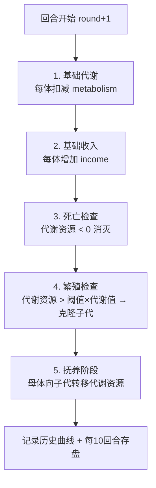
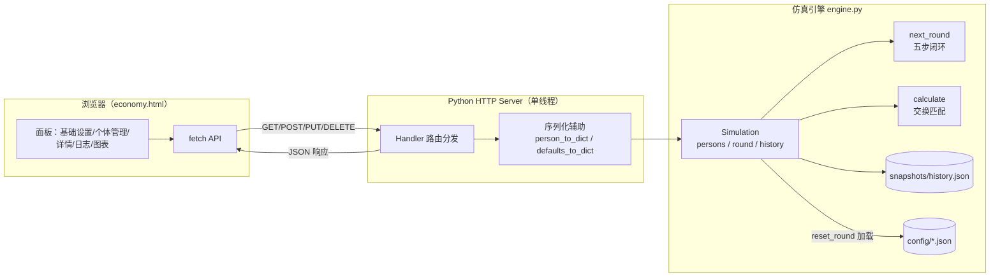
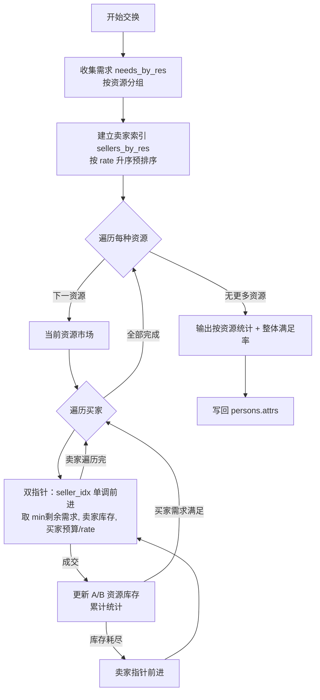

# 经济系统模拟（Money System）

一个基于多智能体的市场经济演化仿真平台。每个"个体"是拥有资源、代谢、收入、需求与交易规则的经济主体，系统按回合推进，模拟代谢消耗、收入、死亡、繁殖、抚养以及基于挂牌定价的市场交换过程。

- **后端**：纯 Python 标准库 `http.server`，无第三方依赖，单线程保证状态一致性
- **前端**：单页 `economy.html`，通过 `fetch` 调用后端 API，使用 ECharts 绘制饼图与历史曲线
- **性能目标**：支持 30 万+ 个体，单回合 < 2 秒，内存 < 2 GB

---

## 目录

- [功能特性](#功能特性)
- [技术栈](#技术栈)
- [项目结构](#项目结构)
- [快速开始](#快速开始)
- [核心概念](#核心概念)
- [仿真流程](#仿真流程)
- [系统架构](#系统架构)
- [交换算法](#交换算法)
- [HTTP API](#http-api)
- [配置文件](#配置文件)
- [基准测试](#基准测试)
- [工程约束与设计要点](#工程约束与设计要点)

---

## 功能特性

- **回合制仿真**：每回合依次执行代谢、收入、死亡、繁殖、抚养五步，随后可执行市场交换计算
- **个体建模**：每个体拥有资源库存、代谢/收入参数、需求列表与挂牌交易规则
- **挂牌交易**：卖方明码标价（1 单位 sell = rate 单位 buy），买方按价格升序优先购买
- **可视化面板**：基础设置、个体管理（搜索/分页）、个体详情、运行日志、人口饼图、历史曲线
- **配置持久化**：基础设置与个体列表以 JSON 文件存于 `config/`，支持导入/导出
- **历史曲线**：每回合记录人口、分组、资源总量，每 10 回合自动存盘到 `snapshots/history.json`

---

## 技术栈

| 层级 | 技术 |
|------|------|
| 后端引擎 | Python 3（标准库，无第三方依赖） |
| HTTP 服务 | `http.server.HTTPServer`（单线程） |
| 前端 | 原生 HTML/CSS/JavaScript + `fetch` |
| 图表 | ECharts（饼图、历史曲线）、Mermaid |
| 数据 | JSON 配置文件 + JSON 历史快照 |

---

## 项目结构

```
money_system/
├── app.py                      # HTTP 服务（路由 + 静态文件 + 序列化）
├── engine.py                   # 仿真引擎（回合逻辑 + 交换算法 + 持久化）
├── economy.html                # 前端单页应用
├── config/
│   ├── economy_defaults.json   # 基础设置（新建个体的模板）
│   └── economy_persons.json    # 初始个体列表
├── snapshots/                  # 运行时历史快照（history.json，每 10 回合存盘）
├── bench_a1.py / bench_a2.py / bench_a3.py   # 性能基准测试脚本
├── test_persist.py             # 持久化冒烟测试
├── 启动经济系统.bat             # Windows 一键启动脚本
└── .gitignore
```

---

## 快速开始

### 环境要求

- Python 3.10+（使用了 `list[dict]`、`int | None` 等类型注解语法）

### 方式一：一键启动（Windows）

双击运行 `启动经济系统.bat`，脚本会自动：
1. 检查 Python 是否在 PATH 中
2. 检测并释放 8000 端口
3. 启动后端服务（新窗口，标题 "MoneySystem API"）
4. 打开浏览器访问 `http://127.0.0.1:8000/`

### 方式二：手动启动

```bash
# 在项目根目录执行
python app.py
```

启动后浏览器访问：<http://127.0.0.1:8000/>

默认监听 `127.0.0.1:8000`，可通过环境变量 `PORT` 修改端口：

```bash
set PORT=9000 && python app.py
```

---

## 核心概念

### 个体（Person）

| 字段 | 说明 |
|------|------|
| `id` / `parentId` | 个体 ID 与母体 ID（繁殖时永久记录） |
| `name` | 名称；子代命名为 `基础名#子代ID`（避免链式 `#` 叠加） |
| `metabolism` | 代谢：每回合扣减 `amount` 单位 `res` 资源 |
| `income` | 收入：每回合增加 `amount` 单位 `res` 资源 |
| `attrs` | 资源库存字典，如 `{"食物": 50, "钱": 100}` |
| `needs` | 需求列表，`{key: 资源名, amount: 需求量}` |
| `rules` | 挂牌规则列表，`{sell, buy, rate}`：1 单位 sell 换 rate 单位 buy |
| `canReproduce` | 是否允许繁殖 |
| `reproThresholdMult` | 繁殖阈值倍数：代谢资源 > 阈值倍数 × 代谢值 时繁殖 |
| `reproInheritMult` | 子代继承倍数：子代初始代谢资源 = 继承倍数 × 代谢值 |

### 基础设置（DefaultSettings）

新建个体时的模板，结构与个体一致（不含 `id`/`parentId`/`name`）。修改后仅影响后续新建的个体。

---

## 仿真流程

### 回合五步闭环

每调用一次「下一回合」，引擎按以下顺序执行：



**关键规则**：
- **死亡**：代谢资源被扣到负数的个体立即消灭，资源随之消失（无遗产）
- **繁殖**：母体消耗 `阈值×代谢值` 的代谢资源，子代继承 `继承倍数×代谢值`，其余资源克隆自母体
- **抚养**：母体按子代代谢值逐个转移资源，资源不足时部分转移或失败

### 回合 + 交换

「下一回合并计算」会在五步闭环结束后，基于回合后状态执行一次市场交换计算。

---

## 系统架构



**数据流**：前端请求 → `Handler._handle` 路由 → 调用 `Simulation` 方法 → 序列化为 JSON 返回。所有状态集中在单例 `sim` 中，单线程服务避免并发读写冲突。

---

## 交换算法

采用**生产者挂牌定价 + 双指针扫描出清**模式：



**复杂度**：
- 需求/卖家按资源分组后，每个市场内双指针扫描为 O(买家数 + 卖家数)
- 整体为 O(N)，预排序为 O(N log N)
- 相比朴素 O(N²) 匹配，通过资源索引大幅降低复杂度

**成交约束**（取三者最小值）：
1. 买家剩余需求量
2. 卖家当前库存
3. 买家支付能力：`买家支付资源 / rate`

---

## HTTP API

| 方法 | 路径 | 说明 |
|------|------|------|
| GET | `/` | 前端页面（economy.html） |
| GET | `/state` | 完整状态：回合数、默认设置、所有个体、摘要 |
| GET | `/defaults` | 当前基础设置 |
| PUT | `/defaults` | 更新基础设置（JSON Body） |
| GET | `/history?from=&to=` | 历史曲线数据切片 |
| POST | `/clear-history` | 清空历史 |
| POST | `/person?name=` | 按默认模板新增个体 |
| PUT | `/person/{id}` | 更新个体（JSON Body） |
| DELETE | `/person/{id}` | 删除个体 |
| POST | `/next-round` | 推进一回合（五步闭环） |
| POST | `/calculate` | 执行本回合交换计算 |
| POST | `/next-and-calc` | 下一回合 + 交换计算 |
| POST | `/reset` | 回合归零并从 config 重新加载 |
| GET | `/export-persons` | 导出个体列表 JSON |
| POST | `/import-persons` | 导入个体列表（JSON Body） |
| GET | `/export-defaults` | 导出基础设置 JSON |
| POST | `/import-defaults` | 导入基础设置（JSON Body） |

所有响应均为 `application/json; charset=utf-8`，错误返回 `{"detail": "..."}` 及对应 HTTP 状态码。

---

## 配置文件

### config/economy_defaults.json

新建个体的模板。示例：

```json
{
  "defaultSettings": {
    "metabolism": { "res": "食物", "amount": 1.0 },
    "income": { "res": "钱", "amount": 1.0 },
    "canReproduce": true,
    "reproThresholdMult": 2.0,
    "reproInheritMult": 1.0,
    "attrs": { "食物": 1.0, "钱": 2.0 },
    "needs": [{ "key": "食物", "amount": 2.0 }],
    "rules": []
  }
}
```

### config/economy_persons.json

初始个体列表。包含劳务公司、食品公司、科技公司三个示例主体，构成「劳动力 ↔ 食物 ↔ 钱」的循环市场。

**资源类型**必须在启动时通过 `attrs`/`needs`/`rules` 预先声明，运行时不可动态新增。

---

## 基准测试

项目包含三个基准脚本，用于验证算法正确性与性能：

| 脚本 | 用途 |
|------|------|
| `bench_a1.py` | 基础性能测试 |
| `bench_a2.py` | 日志汇总模式正确性 + 性能（N ≤ 1000） |
| `bench_a3.py` | 大规模性能测试 |

运行示例：

```bash
python bench_a2.py
```

引擎支持两种日志模式：
- `verbose=False`（默认）：汇总日志（人口变化、事件计数、资源总量变化），适合大规模
- `verbose=True`：每个体每步详细日志，调试用，N 大时慎用

---

## 工程约束与设计要点

1. **单线程 HTTP 服务**：使用 `HTTPServer` 而非 `ThreadingHTTPServer`，避免多线程并发修改 `sim.persons` 导致状态不一致（曾出现 list index out of range）。
2. **子代命名**：使用 `getBaseName(父名) + "#" + 子代ID`，防止多代繁殖后名称出现 `#1#2#3` 链式叠加，保持名称长度恒定。
3. **资源预声明**：资源类型在启动时确定，运行时不动态新增，确保历史曲线与汇总逻辑稳定。
4. **前端性能**：个体列表采用搜索 + 分页（非全量渲染），防止大 N 时 DOM 卡顿。
5. **持久化容错**：`snapshots/history.json` 每 10 回合存盘一次，存盘失败不阻塞主流程。
6. **交换原子性**：交换计算在 `entities` 工作副本上执行，完成后才写回 `persons.attrs`，中途异常不污染原数据。

---

## 许可证

本项目仅供学习与研究使用。
